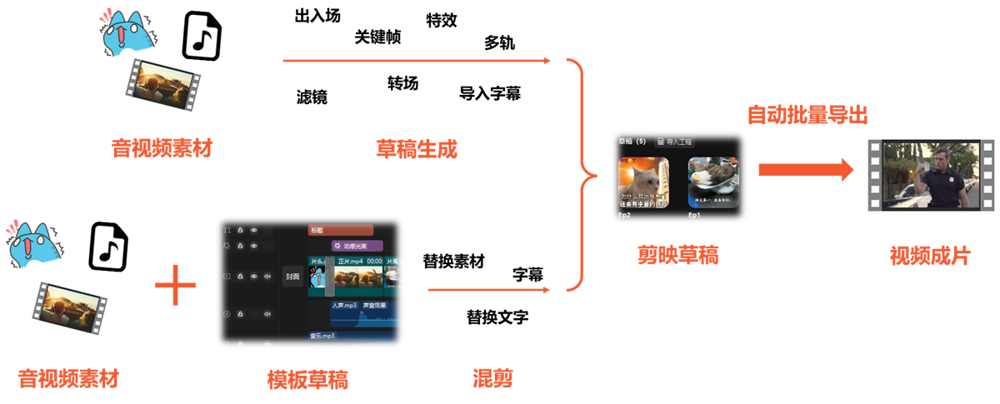
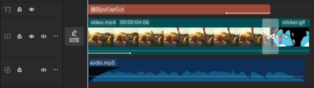
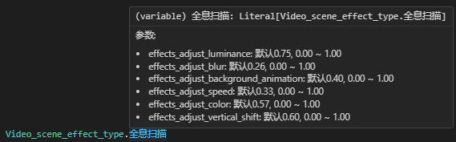

# pyCapCut

### A lightweight, flexible, and easy-to-use Python tool for generating and exporting CapCut drafts to build fully automated video editing/remix pipelines!

[中文版本](README.md)

> 🧪 This project is being migrated from [PyJianYingDraft](https://github.com/GuanYixuan/pyJianYingDraft). Please ⭐️ to stay tuned!

> 📢 Join the [Discord server](https://discord.gg/WfHgGQvhyW) to discuss usage and new features

## Workflow


# Feature List

### Template Mode
> 🧪 This module has just been migrated. If something doesn’t fit your template, please open an issue.

- ☑️ [Load](#load-template) an (unencrypted) `draft_content.json` file as a template
- ☑️ [Replace media for video/audio segments](#replace-media-by-name)
- ☑️ [Modify text contents of text segments](#replace-text-segment-content)
- ☑️ [Import entire audio/video/text tracks from a template draft into another draft](#import-tracks-from-a-template-draft)
- ☑️ [Extract resource metadata (stickers/bubbles/fancy text, etc.)](#extract-resource-metadata)

### Batch Export
> ⚠️ This module is being migrated. If interested, see the corresponding part in [PyJianYingDraft](https://github.com/GuanYixuan/pyJianYingDraft?tab=readme-ov-file#%E6%89%B9%E9%87%8F%E5%AF%BC%E5%87%BA%E8%8D%89%E7%A8%BF)

- ☑️ Control CapCut to open a specific draft
- ☑️ Export a draft to a specific location
- ☑️ Adjust export resolution and frame rate

### Video and Image
> 🧪 This module has just been migrated. If animations/effects/transitions don’t take effect, please open an issue.

- ☑️ Add local video/image media, and [customize segment timing, duration, or playback speed](#source-trimming-and-global-speed)
- ☑️ [Global video adjustments](#global-video-adjustments) (rotation, scale, brightness, etc.) and [keyframe generation](#keyframes)
- ☑️ [In/Out/Group animations](#add-segment-animations) for video segments
- ☑️ Add [masks](#masks), [segment effects](#add-segment-effects), and [filters](#add-segment-filters)
- ☑️ Video background fill [(example code)](demo.py)

### Stickers
- ☑️ Add stickers based on metadata [extraction](#extract-resource-metadata)
- ☑️ [Keyframe](#keyframes) generation for stickers

### Audio
- ☑️ Add local audio media, and [customize segment timing, duration, or playback speed](#source-trimming-and-global-speed)
- ☑️ Adjust fade in/out durations [(example code)](demo.py), adjust volume [(example code)](demo.py), and its [keyframes](#keyframes)
- ☑️ Add [scene audio effects](#add-segment-effects) to audio segments and configure parameters

### Tracks
- ☑️ [Add tracks](#multi-track-operations) and [append segments to a specific track](#multi-track-operations)
- ☑️ Customize [layer ordering](#multi-track-operations) among video/filter/effect tracks

### Effects, Filters, and Transitions
- ☑️ Clip-attached [effects](#add-segment-effects), [filters](#add-segment-filters), and [animations](#add-segment-animations)
- ☑️ [Standalone tracks for effects and filters](#effect-and-filter-tracks)
- ☑️ Add transitions [(example code)](demo.py) and customize duration

### Text and Subtitles
- ☑️ [Add text, set fonts and styles](#add-text), modify [position and rotation](#global-video-adjustments) of text segments
- ☑️ [Keyframes](#keyframes) and [animations](#add-segment-animations) for text
- ☑️ Text stroke and text background
- ☑️ Text bubble effects and fancy text effects [(example code)](demo.py)
- ☑️ [Automatic line wrapping](#automatic-line-wrapping) with configurable max line width
- ☑️ [Import `.srt` files](#import-subtitles) to create subtitles in bulk and style them

## Installation

pyCapCut now supports pip installation (excluding demo).

```bash
pip install pycapcut
```

### Cross-platform Compatibility

Linux and MacOS users can also install and use normally, but note that **generated drafts still need to be exported in Windows version CapCut**.

# Quick Start
The `demo.py` example creates a CapCut draft with audio/video media and a line of text, and adds audio fade-in, a video intro animation, a transition, keyframes, and a text bubble effect.

How to run the example:
1. Find your CapCut Drafts folder path (like `.../CapCut Drafts`) and replace `<your CapCut Drafts folder>` in the code
2. Run `demo.py`
3. In CapCut, find and open the newly created `demo` draft (you may need to enter and exit an existing draft, or restart CapCut to refresh the list). You should see a timeline similar to the image below:



You can closely inspect the audio segment’s volume settings, fade-in duration, etc., and confirm they match the code settings above.

# Usage Guide

> ℹ It’s recommended to jump to interesting features from the [Feature List](#feature-list) instead of reading sequentially.

### Template Mode
> 🧪 This module has just been migrated. If something doesn’t fit, please open an issue.

To retain certain complex features (text effects, compound clips, etc.), you can load an existing CapCut draft as a template, then import parts of it into another draft, or directly replace part of its segments.

Currently three replacement methods are provided:
- [Replace media by name](#replace-media-by-name): replace the media itself, affecting all segments that reference it
- [Replace media by segment](#replace-media-by-segment): replace the media of a specific segment and reselect the source range it references
- [Replace the content of text segments](#replace-text-segment-content): keep all text formatting while replacing its content

Additionally, for items without a clear name (stickers, fancy text, etc.), [extract resource metadata](#extract-resource-metadata) to obtain their `resource_id`.

> ℹ If you encounter missing template content, please report it.

#### Load Template
It is recommended to use `DraftFolder` to manage CapCut’s drafts folder (found in CapCut “Global Settings” → “Drafts Location”), which makes it convenient to generate a new draft from a template.

```python
import pycapcut as cc

draft_folder = cc.DraftFolder("<CapCut Drafts folder>")  # Usually like ".../CapCut Drafts"
script = draft_folder.duplicate_as_template("Template Draft", "New Draft")  # Copy "Template Draft" to a new draft named "New Draft" and open it for editing

# Edit the returned ScriptFile object, e.g., replace media, add tracks and segments

script.save()  # Save your "New Draft"
```

To maximize compatibility with complex features in templates, the imported tracks are kept separate from the tracks created by pycapcut:

- Other than the replacement features below, you cannot add segments, transitions, fades, effects, etc. on imported tracks
- You can still create new tracks and add segments as in non-template mode

> ℹ These limitations on imported tracks may be gradually lifted in future versions

#### Extract Resource Metadata
For an imported `ScriptFile`, call `inspect_material` to extract `resource_id` for certain materials. `DraftFolder` also offers methods to inspect resource metadata of a specified draft.

```python
import pycapcut as cc

draft_folder = cc.DraftFolder("<CapCut Drafts folder>")
draft_folder.inspect_material("Draft Name")

# Or
script = draft_folder.load_template("Draft Name")
script.inspect_material()
```

The output might look like:

```
贴纸素材:
        Resource id: 7405878923323641129 '秋日手绘-枫叶'
        Resource id: 7429353555447893260 '电商购物促销/哇哦'
        Resource id: 7437707455267671315 '冬日涂鸦winter雪花冬天vlog装饰文字'
        Resource id: 7343931192204463401 '爱心'
文字气泡效果:
        Effect id: 763870 ,Resource id: 6838834573413978631 '标题59'
花字效果:
        Resource id: 7342020000812731658 '彩色手绘线条花字'
```

The metadata above can be used to add corresponding materials (e.g., via the `resource_id` parameter of `StickerSegment`).

#### Replace Media by Name
This approach replaces the media itself without directly modifying segments.

> ℹ Since materials have names (by default, the local file name), this replacement is easy to locate

> ℹ Because it doesn’t involve source range changes, this method is especially suitable for image media and rarely causes compatibility issues

Using the draft from [Quick Start](#quick-start) as an example, if we want to replace the audio media with a new one:
```python
new_material = cc.AudioMaterial("<path to new audio file>")
script.replace_material_by_name("audio.mp3", new_material)  # Replace the material named "audio.mp3"
```

After replacement, the segment still trims the first 5 seconds of the media, and properties like volume, fade in/out, playback speed remain unchanged.

#### Replace Media by Segment
This approach replaces a specific segment’s media, allowing you to reselect the source range and stretch/shrink the segment on the timeline accordingly.

> ℹ Since segments have no names, you usually need to locate them by index

This involves two steps: select a track and then replace the media. Using the audio example above:
```python
from pycapcut import trange, ShrinkMode, ExtendMode

audio_track = script.get_imported_track(
    cc.TrackType.audio,                # Select the imported audio track
    #name="audio",                         # If the track has a name, prefer using it
    index=0                                # Or locate by index; 0 means the bottom-most track of the same type
)

script.replace_material_by_seg(
    audio_track, 0, new_material,          # Select the 0-th segment in audio_track (i.e., the first segment)
    #source_timerange=None,                # If not specified, default to use the entire material
    source_timerange=trange("0s", "10s"),  # Here we select the first 10 seconds of the material (note original segment length is 5s)
    handle_shrink=ShrinkMode.cut_tail,     # If the segment shortens, move its end earlier
    handle_extend=ExtendMode.push_tail     # If the segment extends, move its end later; push following segments if needed
)
```

As seen above, this may change the segment duration, so use `handle_shrink` and `handle_extend` to specify behavior when shortening or extending.

> ℹ Default behavior when not specifying `handle_shrink`/`handle_extend`:
> - If the new media is shorter than the original, move the segment end earlier to match the new length
> - If the new media is longer than the original, crop the source range to keep the segment duration unchanged

See enum classes `ShrinkMode` and `ExtendMode` for the full list of behaviors.

> ℹ It’s known that replacing segments with combined in/out animations does not automatically refresh animation timing

#### Replace Text Segment Content
This replaces the content of a specific text segment while keeping all formatting.

This also involves two steps: select a track and then replace the content. The “select track” step is similar to [Replace Media by Segment](#replace-media-by-segment).

Assuming we already selected a text track `text_track`:
```python
script.replace_text(
    text_track, 0,  # Select the 0-th segment in text_track (i.e., the first segment)
    "New text content"     # New text content
)
```

#### Import Tracks from a Template Draft
This literally copies the specified tracks in the template draft into the new draft. Suitable for stitching multiple templates together.

> ℹ Currently only audio/video/text tracks are supported. Support range will expand in the future.

> ⚠️ This method preserves IDs of segments and their materials, therefore you cannot import the same track into the same draft multiple times.

Example:
```python
source_script = draft_folder.load_template("<Template Draft Name>")     # Load the template draft
target_script = draft_folder.create_draft("New Draft", 1920, 1080)  # Create a new draft

# Select a text track from the template
text_track = source_script.get_imported_track(
    cc.TrackType.text,                # Select imported text track
    #name="text",                        # If the track has a name, prefer using it
    index=0                              # Or locate by index; 0 means the bottom-most track of the same type
)

# Import the text track into the new draft
target_script.import_track(
    source_script, text_track,
    offset=target_script.duration,  # Place the imported track at the end of the new draft
    new_name="imported_text",       # Optional new track name
    relative_index=1,               # Relative order among all text tracks; larger values are closer to the foreground; can be negative
)
```

### Time and Tracks

#### Time Format
CapCut (and this project) internally stores time in microseconds, which is not convenient to input. We provide a “string form” for time. Most time parameters support both:
- Microseconds: `int`, suitable for calculation
- String: `str`, like `"1.5s"`, `"1h3m12s"`, convenient for input

If you want to explicitly convert from string to microseconds, use `tim`. `trange` is a convenience constructor for `Timerange` that accepts string inputs.

> ⚠️ Note the second parameter of `trange` is duration, not end time

For example:
```python
import pycapcut as cc
from pycapcut import SEC, tim, trange

# 1 second
assert 1000000 == SEC == tim("1s") == tim("0.01666667m")

# 0~1 minute
assert cc.Timerange(0, 60*SEC) == trange("0s", "1m") == trange("0s", "0.5m30s")

# 2 seconds after a segment starts
seg: cc.VideoSegment
assert seg.target_timerange.start + 2*SEC == seg.target_timerange.start + tim("2s")
```

#### Source Trimming and Global Speed
Trimming and speed are configured when creating a `Segment`, via `target_timerange`, `source_timerange`, and `speed`.
> ℹ Curve speed change is not yet supported

Using `VideoSegment` as example (same for `AudioSegment`). Two construction styles are supported:
1. Convenience constructor: pass a media path string directly to auto-create a material instance
2. Traditional constructor: create the material instance first, then pass it to the segment constructor. Use this when you need to set crop properties on the media.

```python
import os
import pycapcut as cc
from pycapcut import trange, SEC

# Assume we already have a draft object `script` (see “Quick Start”), and create three tracks
for i in range(3, 0, -1): # reverse order
    script.add_track(cc.TrackType.video, "%d" % i)

# The following demonstrates creation of materials and segments
# Method 1: convenience constructor (recommended)
tutorial_asset_dir = os.path.join(os.path.dirname(__file__), 'readme_assets', 'tutorial')
video_path = os.path.join(tutorial_asset_dir, 'video.mp4')

# Pass the media path directly
seg1 = cc.VideoSegment(video_path, trange("0s", "4s"))  # Trim the first 4 seconds of the material

# Method 2: traditional constructor
mat = cc.VideoMaterial(video_path)  # Create the material instance first
seg2 = cc.VideoSegment(mat, trange("0s", "4s"))  # Then pass it to the constructor

# The video material length is 5s
print("Video material length: %f s" % (mat.duration / SEC))

# The following demonstrates source trimming and speed
# If source_timerange is not specified, the first segment of equal length is used automatically
seg11 = cc.VideoSegment(video_path, trange("0s", "4s"))              # Automatically trim first 4 seconds ("4s" means duration)
seg2  = cc.VideoSegment(video_path, trange("0s", "4s"), speed=1.25)  # Automatically trim the first 4*1.25=5 seconds
seg4  = cc.VideoSegment(video_path, trange("0s", "3s"), speed=3.0)   # Trim the first 3*3.0=9 seconds; will error if material is too short

# If source_timerange is specified, trim the specified range and auto-set speed
seg12 = cc.VideoSegment(video_path, trange("4s", "1s"),
                            source_timerange=trange(0, "4s"))     # Play 4s of material within 1s; speed auto-set to 5.0

# If both source_timerange and speed are specified, trim the specified range and override target duration by speed
seg3  = cc.VideoSegment(video_path, trange("1s", "66666h"),
                            source_timerange=trange(0, "5s"),
                            speed=2.0) # Play 5s of material at 2x speed; target duration becomes 2.5s

# Add segments to tracks
script.add_segment(seg11, "1").add_segment(seg12, "1")
script.add_segment(seg2, "2")
script.add_segment(seg3, "3")
```

#### Multi-Track Operations
`ScriptFile.add_track` supports creating multiple tracks of the same type and customizing their order:
```python
script.add_track(cc.TrackType.video,
                 track_name="Foreground",       # Track name
                 relative_index=2)              # Relative position among all video tracks
script.add_track(cc.TrackType.video,
                 track_name="Background",
                 relative_index=1)              # Since 1 < 2, the background track is below the foreground
```

> ℹ For tracks with the same index, tracks created later are placed on top by default

Once multiple tracks of the same type exist, you must specify the target track when adding segments, e.g.:
```python
script.add_segment(video_segment, "Background")
```

### Global Video Adjustments
Each video segment can set crop, rotation, flip, scale, opacity, brightness, etc. via the `clip_settings` parameter of the `VideoSegment` constructor.
> ℹ Keyframes have higher priority than global adjustments, so keyframes override corresponding global settings

Example: create a video segment and set its opacity to 0.5 and enable horizontal flip:
```python
from pycapcut import ClipSettings
video_segment = cc.VideoSegment(video_material,
                                   cc.Timerange(0, video_material.duration),      # Same length as the material
                                   clip_settings=ClipSettings(alpha=0.5,             # Opacity 0.5
                                                              flip_horizontal=True)  # Enable horizontal flip
                                    )
```

See the `ClipSettings` constructor for detailed parameters.

### Keyframes
A keyframe is a pair of (time within the segment, value) attached to a segment. To create keyframes, call `add_keyframe` with the time relative to the segment start, the value, and the property to control.
> ℹ Currently keyframes for effect or filter parameters are not supported

The following example simulates a fade-out using two opacity keyframes:
```python
import os
import pycapcut as cc
from pycapcut import KeyframeProperty, SEC

# Assume we already have a draft object `script` (see “Quick Start”), and create a video track
script.add_track(cc.TrackType.video)
tutorial_asset_dir = os.path.join(os.path.dirname(__file__), 'readme_assets', 'tutorial')

# Create a video segment
video_material = cc.VideoMaterial(os.path.join(tutorial_asset_dir, 'video.mp4'))
video_segment = cc.VideoSegment(video_material,
                                   cc.Timerange(0, video_material.duration)) # Same length as the material

# Add two opacity keyframes to make a 1s fade-out
video_segment.add_keyframe(KeyframeProperty.alpha, video_segment.duration - SEC, 1.0) # Fully opaque 1s before end
video_segment.add_keyframe(KeyframeProperty.alpha, video_segment.duration, 0.0) # Fully transparent at end

# Add the segment to the track
script.add_segment(video_segment)
```

Besides `alpha`, `KeyframeProperty` includes translation, rotation, scale, volume, saturation, etc., all of which support keyframes. Text and sticker segments also support keyframes for position-/size-related properties only.

For audio segments, currently only volume keyframes are supported, and you do not need to specify `KeyframeProperty`:
```python
audio_segment: cc.AudioSegment
audio_segment.add_keyframe("0s", 0.6) # Volume is 60% at the start of the segment
```

### Masks
Adding masks is simple: call `VideoSegment.add_mask`:
```python
from pycapcut import MaskType

# Add a linear mask centered at (100, 0) pixels on the material, rotated 45 degrees clockwise
video_segment1.add_mask(MaskType.线性, center_x=100, rotation=45)
# Add a circular mask with diameter 50% of the material
video_segment2.add_mask(MaskType.圆形, size=0.5)
```
Where:
- `MaskType` stores CapCut’s built-in mask types
- `center_x` and `center_y` are the mask center coordinates, same meaning as in CapCut
- `rotation`, `feather`, and `round_corner` correspond to rotation, feathering, and round-corner parameters, same as in CapCut
- `size` is the “primary size” (visible surface height/ circle diameter/ heart height, etc.) as a proportion of the material

See the `add_mask` docstring for more details.

### Effects, Animations, and Filters
#### Effect Types
Currently supported effect enums:
- Audio: `AudioSceneEffectType` (scene audio)
- Video: `VideoSceneEffectType` (visual effects), `VideoCharacterEffectType` (character effects)

Currently supported animation enums:
- Video: `IntroType` (intro), `OutroType` (outro), `GroupAnimationType` (group animation)
- Text: `TextIntro` (intro), `TextOutro` (outro), `TextLoopAnim` (looping animation)

Filter types are in `FilterType`, only for video segments.

Enum members are (usually) named directly after effect/filter names, with parameter annotations, for example:



You can also use `from_name` to get a specific member, ignoring case, spaces, and underscores, e.g.:

```python
assert VideoSceneEffectType.from_name("__全息 扫描__") == VideoSceneEffectType.全息扫描
```

> ⚠️ Not all enum-listed effects are necessarily usable. Please verify the effect can be found in the CapCut UI before using it.

#### Add Segment Effects
Use `segment.add_effect()` to add effects. It accepts an effect type and a parameter array. The parameter order matches the order in the effect type’s annotations, which may differ from the order in the CapCut UI.

Example: add the `全息扫描` effect to a video segment, set `氛围` to 100 (CapCut value), others default:
```python
from pyJianYingDraft import VideoSceneEffectType

video_segment.add_effect(VideoSceneEffectType.全息扫描,
                         [None, None, 100.0]) # Leave first two params unset; third param (氛围) is 100; others unset
```
Audio segment effects are added similarly.

#### Add Segment Filters
Filters are added similarly via `VideoSegment.add_filter()`. Filters support a single “intensity” parameter.

```python
from pyJianYingDraft import FilterType

video_segment1.add_filter(FilterType.原生肤, 10)  # Set intensity of "原生肤" to 10
video_segment2.add_filter(FilterType.冰雪世界, 50)  # Set intensity of "冰雪世界" to 50
```

#### Effect and Filter Tracks
Besides attaching effects and filters to video segments, you can create standalone effect and filter tracks and add effect/filter segments to them.

First, create an effect track or filter track via `ScriptFile.add_track()`. For ordering, see [Multi-Track Operations](#multi-track-operations)
```python
script.add_track(draft.TrackType.effect, "my_effect")  # Create an effect track named "my_effect"
script.add_track(draft.TrackType.filter, "my_filter")  # Create a filter track named "my_filter"
```

Then use `add_effect` and `add_filter` to add segments to those tracks:
```python
from pyJianYingDraft import VideoSceneEffectType, FilterType, trange

# Add a "胶片闪切" effect on the effect track, lasting 5s, with parameters
script.add_effect(VideoSceneEffectType.胶片闪切, trange("0s", "5s"),
                  track_name="my_effect",  # Can be omitted if only one effect track
                  params=[50, None, 80])   # Set speed=50, keep intensity default (100), set texture=80

# Add a "冷蓝" filter to last for the entire video, intensity 70
script.add_filter(FilterType.冷蓝, trange(0, script.duration),
                  track_name="my_filter",  # Can be omitted if only one filter track
                  intensity=70)
```

#### Add Segment Animations
Use `segment.add_animation()` to add animations. It only takes an animation type; its duration uses the default value. To add multiple animations, call the method multiple times on the same segment.

> ℹ For text segments, if you need both loop and in/out animations, add in/out animations first, then the loop animation

Example of adding three animations to a text segment:
```python
from pyJianYingDraft import TextIntro, TextOutro, TextLoopAnim

text_seg.add_animation(TextIntro.复古打字机).add_animation(TextOutro.弹簧)
text_seg.add_animation(TextLoopAnim.色差故障)  # Note: loop animations must be added after in/out animations
```


### Text and Subtitles
#### Add Text
Adding text is similar to adding video/audio segments: create a `TextSegment` and add it via `add_segment`. Font, text style, and image adjustments are specified via `font`, `style`, and `clip_settings`.

Example:
```python
import pycapcut as cc
from pycapcut import FontType, TextStyle, ClipSettings

# A light-blue subtitle-like text with underline and positioned like subtitles
seg1 = cc.TextSegment("Subtitle", trange("0s", "10s"),
                          font=FontType.文轩体,
                          style=TextStyle(size=5.0, color=(0.7, 0.7, 1.0), underline=True, align=1),
                          clip_settings=ClipSettings(transform_y=-0.8))
```

See `TextStyle` and `ClipSettings` constructors for details.

#### Automatic Line Wrapping
Text segments support auto-wrapping via `TextStyle.auto_wrapping` and `TextStyle.max_line_width`:

```python
# Enable auto wrapping, with max line width at 70% of screen width
seg2 = cc.TextSegment("This is a long text; when it exceeds the set max line width, it wraps automatically.", 
                          trange("0s", "10s"),
                          font=FontType.文轩体,
                          style=TextStyle(size=5.0, 
                                          auto_wrapping=True,      # Enable auto wrapping
                                          max_line_width=0.7))     # Max line width at 70% of screen
```

#### Import Subtitles
> ℹ Currently only SRT format is supported

Importing subtitles essentially creates a series of texts based on each subtitle’s timestamps and content, and adds them to a track. This is done via `ScriptFile.import_srt`. Imported subtitles enable auto-wrapping by default.

Example:
```python
import pycapcut as cc

# Assume we already have a draft object `script` (see “Quick Start”)

# Import subtitles into a track named "subtitle". If the track does not exist, it will be created automatically.
# If `style` and `clip_settings` are not specified, defaults mimic CapCut’s imported subtitle style.
script.import_srt("subtitle.srt", track_name="subtitle", time_offset="1.5s")  # Shift the subtitles by 1.5s

# Adjust subtitle styles using `text_style` and `clip_settings` (same semantics as in `TextSegment()`)
script.import_srt("subtitle.srt", track_name="subtitle",
                  text_style=cc.TextStyle(size=10.0, color=(1.0, 0.0, 0.0))
                  clip_settings=cc.ClipSettings(transform_y=0.8))  # Place subtitles at the top of the screen

# For more complex styles or to apply animations, pass a `TextSegment` as `style_reference` (text and duration are ignored)
# Note animation timing does not adapt to segment length; very short subtitle segments may look odd
script.import_srt("subtitle.srt", track_name="subtitle", style_reference=seg1)  # Use `seg1` from “Add Text” as reference

# By default `clip_settings` from `style_reference` is not applied. Pass `clip_settings=None` if you want to adopt it.
script.import_srt("subtitle.srt", track_name="subtitle", style_reference=seg1, clip_settings=None)  # Equivalent to clip_settings=seg1.clip_settings
```
