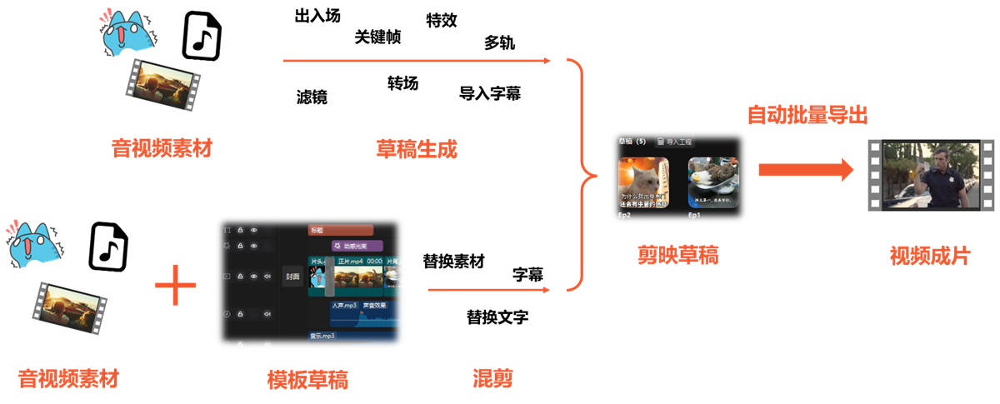
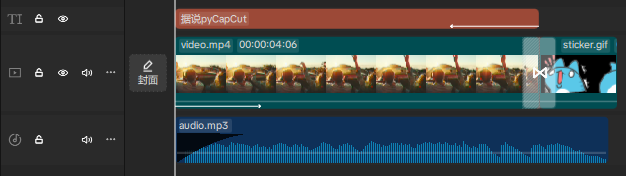
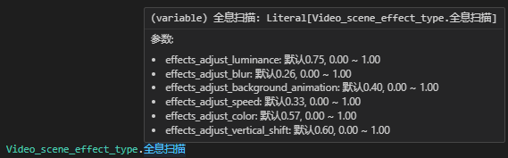

# pyCapCut

### [PyJianYingDraft](https://github.com/GuanYixuan/pyJianYingDraft)와 같은 뿌리를 가진, 가볍고 유연하며 사용하기 쉬운 Python CapCut 초안 생성 및 내보내기 도구로, 완전 자동화된 영상 편집/믹스 파이프라인을 구축하세요!

[English Version](english_readme.md) | [中文版本](README.md)

> 🧪 이 프로젝트는 [PyJianYingDraft](https://github.com/GuanYixuan/pyJianYingDraft)에서 마이그레이션 중입니다. ⭐️를 눌러 계속 지켜봐 주세요!

> 📢 [Discord 서버](https://discord.gg/WfHgGQvhyW)에 참여해 사용법이나 새 기능에 대해 이야기해보세요

## 사용 흐름


# 기능 목록

### 템플릿 모드
> 🧪 이 모듈은 방금 마이그레이션이 완료되었습니다. 맞지 않는 부분이 있다면 이슈를 남겨주세요

- ☑️ 암호화되지 않은 `draft_content.json` 파일을 템플릿으로 [로드](#템플릿-로드)
- ☑️ [오디오/비디오 세그먼트의 소재 교체](#이름으로-소재-교체)
- ☑️ [텍스트 세그먼트의 내용 수정](#텍스트-세그먼트-내용-교체)
- ☑️ [템플릿 초안의 오디오/비디오/텍스트 트랙을 다른 초안으로 통째로 가져오기](#템플릿-초안의-트랙-가져오기)
- ☑️ [템플릿에 포함된 스티커/말풍선/화려한 텍스트 등의 메타데이터 추출](#소재-메타데이터-추출)

### 일괄 내보내기
> ⚠️ 이 모듈은 마이그레이션 중입니다. 관심 있으시면 [PyJianYingDraft의 해당 부분](https://github.com/GuanYixuan/pyJianYingDraft?tab=readme-ov-file#%E6%89%B9%E9%87%8F%E5%AF%BC%E5%87%BA%E8%8D%89%E7%A8%BF)을 참고하세요

- ☑️ CapCut이 지정한 초안을 열도록 제어
- ☑️ 초안을 지정한 위치로 내보내기
- ☑️ 내보내기 해상도와 프레임 레이트 조정

### 영상과 이미지
> 🧪 이 모듈은 방금 마이그레이션이 완료되었습니다. 특효/애니메이션/전환 등이 적용되지 않는 경우 이슈를 남겨주세요

- ☑️ 로컬 비디오/이미지 소재 추가 및 [세그먼트의 시간, 길이, 재생 속도 커스터마이즈](#소재-자르기-및-전체-배속)
- ☑️ 비디오 세그먼트의 오디오 페이드인/아웃 효과
- ☑️ [영상 전체 조정](#영상-전체-조정)(회전, 확대/축소, 밝기 등) 및 [키프레임](#키프레임) 생성
- ☑️ 비디오 세그먼트의 [입장/퇴장/조합 애니메이션](#세그먼트-애니메이션-추가)
- ☑️ [마스크](#마스크), [세그먼트 특효](#세그먼트-특효-추가), [필터](#세그먼트-필터-추가) 추가
- ☑️ 비디오 배경 채우기 [(예제 코드)](demo.py)
### 스티커
- ☑️ 메타데이터를 기반으로 [스티커 추가](#소재-메타데이터-추출)
- ☑️ 스티커의 [키프레임](#키프레임) 생성
### 오디오
- ☑️ 로컬 오디오 소재 추가 및 [세그먼트의 시간, 길이, 재생 속도 커스터마이즈](#소재-자르기-및-전체-배속)
- ☑️ 페이드인/아웃 길이 조정 [(예제 코드)](demo.py), 볼륨 조정 [(예제 코드)](demo.py) 및 [키프레임](#키프레임)
- ☑️ 오디오 세그먼트에 [장면 음향 효과](#세그먼트-특효-추가) 추가 및 파라미터 설정
### 트랙
- ☑️ [트랙 추가](#멀티-트랙-작업) 및 [지정한 트랙에 세그먼트 추가](#멀티-트랙-작업)
- ☑️ 비디오/필터/특효 트랙의 [레이어 순서](#멀티-트랙-작업) 커스터마이즈
### 특효, 필터와 전환
- ☑️ 세그먼트에 붙는 [특효](#세그먼트-특효-추가), [필터](#세그먼트-필터-추가)와 [애니메이션](#세그먼트-애니메이션-추가)
- ☑️ [독립된 트랙에 위치한 특효와 필터](#독립-트랙의-특효와-필터)
- ☑️ 전환 추가 [(예제 코드)](demo.py) 및 길이 커스터마이즈
### 텍스트 및 자막
- ☑️ [텍스트 추가, 폰트 및 스타일 설정](#텍스트-추가), 텍스트 세그먼트의 [위치 및 회전 설정](#영상-전체-조정) 수정
- ☑️ 텍스트의 [키프레임](#키프레임) 및 [애니메이션](#세그먼트-애니메이션-추가)
- ☑️ 텍스트 테두리, 배경, 그림자
- ☑️ 텍스트 말풍선 효과와 화려한 텍스트 효과 [(예제 코드)](demo.py)
- ☑️ 텍스트 [자동 줄바꿈](#텍스트-자동-줄바꿈), 최대 줄 너비 설정 지원
- ☑️ [`.srt` 파일 가져오기](#자막-가져오기)로 자막 생성 및 일괄 서식 설정

# 설치
pyCapCut은 이제 pip 설치를 지원합니다 (demo 제외)
```bash
pip install pycapcut
```

### 크로스 플랫폼 호환성
Linux와 macOS 사용자도 정상적으로 설치 및 사용할 수 있지만, **생성된 초안은 여전히 Windows용 CapCut에서 내보내기 해야 합니다**.

# 빠른 시작
예제 `demo.py`는 오디오/비디오 소재와 한 줄의 텍스트가 포함된 CapCut 초안 파일을 생성하며, 오디오 페이드인, 비디오 입장 애니메이션, 전환 효과, 키프레임, 텍스트 말풍선/화려한 텍스트를 추가합니다.

이 예제의 실행 방법은 다음과 같습니다:
1. CapCut의 **초안 폴더 경로**(`.../CapCut Drafts`와 비슷한 형태)를 찾아, `demo.py` 코드 안의 `<你的草稿文件夹>`(초안 폴더 자리 표시자)를 그 경로로 교체하세요
2. `demo.py`를 실행하세요
3. CapCut에서 **새로 생성된 `demo` 초안을 찾아 열어보세요**(기존 초안에 들어갔다 나오거나, CapCut을 재시작해야 초안 목록이 갱신될 수 있습니다). 아래와 비슷한 타임라인이 보일 것입니다:



오디오 세그먼트의 볼륨 설정, 페이드인 효과 길이 등을 자세히 확인해서 위 코드의 설정과 일치하는지 확인해보세요

# 사용법 문서

> ℹ️ [기능 목록](#기능-목록)에서 관심 있는 기능을 골라 읽는 것을 추천합니다. 순서대로 읽지 않아도 됩니다

### 템플릿 모드
> 🧪 이 모듈은 방금 마이그레이션이 완료되었습니다. 맞지 않는 부분이 있다면 이슈를 남겨주세요

일부 복잡한 특성(텍스트 특효, 복합 세그먼트 등)을 유지하기 위해, 기존 CapCut 초안을 템플릿으로 로드한 뒤 그 안의 내용을 다른 초안으로 가져오거나, 그중 일부 세그먼트의 내용을 직접 **교체**할 수 있습니다.

현재 **세 가지 교체 기능**을 제공합니다:
- [이름으로 소재 교체](#이름으로-소재-교체): 소재 자체를 직접 교체하며, 자연스럽게 해당 소재를 참조하는 모든 세그먼트에 영향을 줍니다
- [세그먼트로 소재 교체](#세그먼트로-소재-교체): 특정 세그먼트의 소재를 교체하는 동시에 참조하는 소재 범위를 다시 선택합니다
- [텍스트 세그먼트 내용 교체](#텍스트-세그먼트-내용-교체): 모든 텍스트 서식을 유지하면서 내용만 교체합니다

이 외에도 특정 이름이 없는 특성(스티커, 화려한 텍스트 등)을 위해 [소재 메타데이터 추출](#소재-메타데이터-추출) 기능을 제공하여 `resource_id`를 추출할 수 있습니다

> ℹ️ 템플릿 내용이 누락되는 경우가 있다면 피드백 부탁드립니다

#### 템플릿 로드
CapCut의 초안 폴더를 관리할 때는 `DraftFolder`를 사용하는 것을 추천합니다(CapCut의 `전체 설정`-`초안 위치`에서 확인 가능), 이렇게 하면 기존 템플릿을 기반으로 새 초안을 손쉽게 생성할 수 있습니다.

```python
import pycapcut as cc

draft_folder = cc.DraftFolder("<CapCut 초안 폴더>")  # 보통 ".../CapCut Drafts" 형태입니다
script = draft_folder.duplicate_as_template("템플릿_초안", "새_초안")  # "템플릿_초안"을 복제해 "새_초안"이라는 이름으로 만들고, 편집을 위해 엽니다

# 반환된 ScriptFile 객체를 편집합니다 (예: 소재 교체, 트랙/세그먼트 추가 등)

script.save()  # "새_초안"을 저장합니다
```

템플릿의 복잡한 특성과 최대한 호환되도록, **가져온 트랙은 pycapcut이 새로 생성한 트랙과 분리되어 있습니다**. 구체적으로는:

- 아래에 설명하는 교체 기능을 제외하면, 가져온 트랙 위에 세그먼트/전환/페이드인아웃/특효 등을 추가할 수 없습니다
- **여전히 새로운 트랙을 만들고 그 위에 세그먼트 등을 추가할 수 있습니다**, 템플릿 모드가 아닐 때와 동일하게요

> ℹ️ 가져온 트랙에 대한 이런 제한은 이후 버전에서 점차 해제될 수 있습니다

#### 소재 메타데이터 추출
가져온 `ScriptFile` 객체에서 `inspect_material` 메서드를 호출하면 일부 소재의 `resource_id`를 추출할 수 있습니다.
`DraftFolder`에도 지정한 초안의 소재 메타데이터를 추출하는 메서드가 있습니다.

```python
import pycapcut as cc

draft_folder = cc.DraftFolder("<CapCut 초안 폴더>")
draft_folder.inspect_material("초안_이름")

# 또는
script = draft_folder.load_template("초안_이름")
script.inspect_material()
```

위 코드의 출력 결과는 다음과 비슷합니다 (CapCut 소재 이름은 원본 그대로 출력되며, `贴纸素材`는 스티커 소재, `文字气泡效果`는 텍스트 말풍선 효과, `花字效果`는 화려한 텍스트 효과를 의미합니다):

```
贴纸素材:
        Resource id: 7405878923323641129 '秋日手绘-枫叶'
        Resource id: 7429353555447893260 '电商购物促销/哇哦'
        Resource id: 7437707455267671315 '冬日涂鸦winter雪花冬天vlog装饰文字'
        Resource id: 7343931192204463401 '爱心'
文字气泡效果:
        Effect id: 763870 ,Resource id: 6838834573413978631 '标题59'
花字效果:
        Resource id: 7342020000812731658 '彩色手绘线条花字'
```

이 메타데이터는 해당 소재를 추가할 때 사용할 수 있습니다 (예: `StickerSegment`의 `resource_id` 파라미터를 통해)

#### 이름으로 소재 교체
이 방법은 세그먼트를 직접 수정하지 않고 소재 자체를 교체합니다.

> ℹ️ 소재는 이름을 가지고 있으므로(기본값은 로컬 파일명) 이 방식으로 손쉽게 위치를 지정할 수 있습니다

> ℹ️ 시간 범위 수정이 필요 없기 때문에, 이 교체 방식은 **이미지 소재에 특히 적합**하며 호환성 문제가 거의 발생하지 않습니다

[빠른 시작](#빠른-시작)의 초안을 예로 들어, 새 오디오 소재로 교체하고 싶다면:
```python
new_material = cc.AudioMaterial("<새 오디오 소재 경로>")
script.replace_material_by_name("audio.mp3", new_material)  # 이름이 "audio.mp3"인 소재를 교체
```

새 소재로 교체한 뒤에도 세그먼트가 잘라내는 구간은 여전히 소재의 앞 5초이며, 볼륨, 페이드인/아웃, 재생 속도 등도 그대로 유지됩니다.

#### 세그먼트로 소재 교체
이 방법은 **특정 세그먼트**의 소재를 교체하는 동시에, **참조하는 소재 범위를 다시 선택**하고 **새 길이에 맞춰 타임라인 상의 세그먼트를 늘리거나 줄일 수 있습니다**.

> ℹ️ 세그먼트에는 이름이 없으므로, 보통 **세그먼트의 인덱스로 위치를 지정**해야 합니다

이 과정은 **트랙 선택**과 **소재 교체** 두 단계로 나뉩니다. 위의 오디오 소재 교체를 예로 들면:
```python
from pycapcut import trange, ShrinkMode, ExtendMode

audio_track = script.get_imported_track(
    cc.TrackType.audio,                # 가져온 오디오 트랙을 선택
    #name="audio",                         # 트랙에 이름이 있다면 이름으로 지정하는 것이 좋습니다
    index=0                                # 인덱스로도 지정 가능, 0은 같은 타입 중 가장 아래 트랙을 의미
)

script.replace_material_by_seg(
    audio_track, 0, new_material,          # audio_track에서 인덱스 0인 세그먼트, 즉 첫 번째 세그먼트를 선택
    #source_timerange=None,                # 지정하지 않으면 기본적으로 소재 전체를 사용합니다
    source_timerange=trange("0s", "10s"),  # 여기서는 소재의 앞 10초를 잘라냅니다(원래 세그먼트 길이는 5초였습니다)
    handle_shrink=ShrinkMode.cut_tail,     # 세그먼트를 줄여야 한다면 종료 지점을 앞당겨서 처리
    handle_extend=ExtendMode.push_tail     # 세그먼트를 늘려야 한다면 종료 지점을 뒤로 밀어서 처리하며, 필요하면 뒤따르는 세그먼트도 밀립니다
)
```

예시에서 볼 수 있듯이, 이 교체 방식은 세그먼트의 길이 변화를 일으킬 수 있으므로 `handle_shrink`와 `handle_extend` 파라미터로 줄어들거나 늘어날 때의 처리 방식을 지정할 수 있습니다.

> ℹ️ `handle_shrink`와 `handle_extend`를 명시적으로 지정하지 않으면 기본 처리 방식은 다음과 같습니다:
> - 새 소재가 원본보다 짧으면, 세그먼트 종료 지점을 앞당겨 세그먼트 길이를 새 소재 길이에 맞춥니다
> - 새 소재가 원본보다 길면, 소재 범위를 잘라내어 세그먼트의 원래 길이를 유지합니다

구체적인 처리 방식 목록은 열거형 클래스 `ShrinkMode`와 `ExtendMode`의 정의를 참고하세요.

> ℹ️ 현재는 조합 입장/퇴장 애니메이션이 있는 세그먼트를 교체할 때 애니메이션 시간이 자동으로 갱신되지 않는 것으로 알려져 있습니다

#### 텍스트 세그먼트 내용 교체
이 방법은 **특정 텍스트 세그먼트**의 내용을 교체하되, 모든 서식은 그대로 유지합니다.

이 과정 역시 **트랙 선택**과 **내용 교체** 두 단계로 나뉩니다. "트랙 선택"은 [세그먼트로 소재 교체](#세그먼트로-소재-교체)의 예시를 참고하세요.

적절한 텍스트 트랙 `text_track`을 이미 선택했다고 가정하면:
```python
script.replace_text(
    text_track, 0,  # text_track에서 인덱스 0인 세그먼트, 즉 첫 번째 세그먼트를 선택
    "새로운 텍스트 내용"     # 새로운 텍스트 내용
)
```

#### 템플릿 초안의 트랙 가져오기

이 기능은 템플릿 초안의 지정한 트랙을 말 그대로 새 초안에 복사합니다. 여러 개의 템플릿 초안을 이어붙일 때 적합합니다.

> ℹ️ **현재는 오디오/비디오/텍스트 트랙 가져오기만 지원**하며, 지원 범위는 앞으로 계속 확장될 예정입니다

> ⚠️ 이 방법은 각 세그먼트와 소재의 id를 그대로 유지하므로, **같은 트랙을 같은 초안에 여러 번 가져올 수는 없습니다**

예시:
```python
source_script = draft_folder.load_template("<템플릿_초안_이름>")     # 템플릿 초안을 로드
target_script = draft_folder.create_draft("새_초안", 1920, 1080)  # 새 초안을 생성

# 템플릿의 텍스트 트랙 하나를 선택
text_track = source_script.get_imported_track(
    cc.TrackType.text,                # 가져온 텍스트 트랙을 선택
    #name="text",                        # 트랙에 이름이 있다면 이름으로 지정하는 것이 좋습니다
    index=0                              # 인덱스로도 지정 가능, 0은 같은 타입 중 가장 아래 트랙을 의미
)

# 텍스트 트랙을 새 초안으로 가져오기
target_script.import_track(
    source_script, text_track,
    offset=target_script.duration,  # 가져온 트랙은 새 초안의 맨 끝에 배치됩니다
    new_name="imported_text",       # 선택적으로 새 트랙 이름을 지정할 수 있습니다
    relative_index=1,               # 모든 텍스트 트랙 중에서의 상대적 위치, 값이 클수록 전경에 가까우며 음수도 가능합니다
)
```

### 시간과 트랙

#### 시간 형식
**CapCut(그리고 이 프로젝트) 내부에서는 모두 마이크로초 단위로 시간을 저장**하지만, 이는 입력하기 불편하기 때문에 "문자열 형태"의 시간 표현을 추가했습니다. 대부분의 시간 파라미터는 두 형태를 모두 지원합니다:
- 마이크로초 형태: `int`로 표현하며, 계산에 적합합니다
- 문자열 형태: `str`로 표현하며, `"1.5s"`, `"1h3m12s"` 등 입력하기 편합니다

문자열 형태를 마이크로초 형태로 명시적으로 변환하고 싶다면 `tim` 함수를 사용할 수 있습니다. `trange` 함수는 문자열 형태 입력을 지원하는 `Timerange`의 편의 생성자입니다.

> ⚠️ `trange`의 두 번째 인자는 **지속 시간**이지, 종료 시간이 아니라는 점에 주의하세요

예시:
```python
import pycapcut as cc
from pycapcut import SEC, tim, trange

# 1초
assert 1000000 == SEC == tim("1s") == tim("0.01666667m")

# 0~1분
assert cc.Timerange(0, 60*SEC) == trange("0s", "1m") == trange("0s", "0.5m30s")

# 세그먼트 시작 후 2초
seg: cc.VideoSegment
assert seg.target_timerange.start + 2*SEC == seg.target_timerange.start + tim("2s")
```

#### 소재 자르기 및 전체 배속
자르기와 배속은 모두 `Segment`를 생성할 때 `target_timerange`, `source_timerange`, `speed` 파라미터를 통해 함께 설정됩니다.
> ℹ️ 현재 곡선 배속 설정은 지원하지 않습니다

아래에서는 `VideoSegment`를 예로 들며, `AudioSegment`도 사용법이 동일합니다. 두 클래스 모두 두 가지 생성 방식을 지원합니다:
1. **간편 생성**: 소재 경로 문자열을 직접 전달하면 소재 인스턴스가 자동으로 생성됩니다
2. **전통적 생성**: 먼저 소재 인스턴스를 생성한 뒤 세그먼트 생성자에 전달합니다. **소재의 이미지 크롭 속성을 설정해야 한다면 이 방식을 사용하세요**

```python
import os
import pycapcut as cc
from pycapcut import trange, SEC

# 이미 초안 파일 script가 있다고 가정하고("빠른 시작" 참고), 트랙 세 개를 생성합니다
for i in range(3, 0, -1): # 역순
    script.add_track(cc.TrackType.video, "%d" % i)

# 아래는 소재와 세그먼트 생성 방법을 설명합니다
# 방식 1: 간편 생성 (추천)
tutorial_asset_dir = os.path.join(os.path.dirname(__file__), 'readme_assets', 'tutorial')
video_path = os.path.join(tutorial_asset_dir, 'video.mp4')

# 소재 경로를 직접 전달
seg1 = cc.VideoSegment(video_path, trange("0s", "4s"))  # 소재의 앞 4초를 잘라냅니다

# 방식 2: 전통적 생성
mat = cc.VideoMaterial(video_path)  # 먼저 소재 인스턴스를 생성
seg2 = cc.VideoSegment(mat, trange("0s", "4s"))  # 세그먼트 생성자에 전달

# 비디오 소재의 길이는 5초입니다
print("Video material length: %f s" % (mat.duration / SEC))

# 아래는 소재의 시간 자르기와 배속을 설명합니다
# source_timerange를 지정하지 않으면 자동으로 앞에서부터 같은 길이만큼 잘라냅니다
seg11 = cc.VideoSegment(video_path, trange("0s", "4s"))              # 소재의 앞 4초를 자동으로 잘라냅니다("4s"는 지속 시간을 의미)
seg2  = cc.VideoSegment(video_path, trange("0s", "4s"), speed=1.25)  # 소재의 앞 4*1.25=5초를 자동으로 잘라냅니다
seg4  = cc.VideoSegment(video_path, trange("0s", "3s"), speed=3.0)   # 앞 3*3.0=9초를 잘라내려 하지만, 소재 길이가 부족해 오류가 발생합니다

# source_timerange를 지정하면 소재의 지정한 구간을 잘라내고, 속도는 자동으로 설정됩니다
seg12 = cc.VideoSegment(video_path, trange("4s", "1s"),
                            source_timerange=trange(0, "4s"))     # 소재를 1초 안에 다 재생하도록, 속도가 자동으로 4.0으로 설정됩니다

# source_timerange와 speed를 동시에 지정하면 소재의 지정한 구간을 잘라내고, 재생 속도에 따라 target_timerange의 길이를 덮어씁니다
seg3  = cc.VideoSegment(video_path, trange("1s", "66666h"),
                            source_timerange=trange(0, "5s"),
                            speed=2.0) # 길이 5초인 소재를 2배속으로 재생하며, target_timerange의 길이는 자동으로 2.5초가 됩니다

# 세그먼트를 트랙에 추가
script.add_segment(seg11, "1").add_segment(seg12, "1")
script.add_segment(seg2, "2")
script.add_segment(seg3, "3")
```

#### 멀티 트랙 작업
현재 `ScriptFile.add_track` 메서드는 같은 타입의 트랙을 여러 개 만들 수 있고, 순서도 커스터마이즈할 수 있습니다:
```python
script.add_track(cc.TrackType.video,
                 track_name="전경",       # 트랙 이름
                 relative_index=2)        # 모든 비디오 트랙 중에서의 상대적 위치
script.add_track(cc.TrackType.video,
                 track_name="배경",
                 relative_index=1)        # 1 < 2이므로 전경 트랙이 더 위에 위치합니다
```

> ℹ️ 인덱스가 같은 트랙의 경우, 기본적으로 **나중에 생성된 트랙이 위쪽에 위치**합니다

같은 타입의 트랙을 여러 개 생성했다면, 세그먼트를 추가할 때 반드시 대상 트랙을 지정해야 합니다. 예:
```python
script.add_segment(video_segment, "배경")
```

### 영상 전체 조정
각 비디오 세그먼트는 크롭, 회전, 반전, 확대/축소, 투명도, 밝기 등의 속성을 개별적으로 설정할 수 있으며, 이런 설정은 `VideoSegment` 생성자의 `clip_settings` 파라미터를 통해 전달합니다
> ℹ️ 키프레임의 우선순위가 전체 조정보다 높으므로, 키프레임이 전체 조정의 해당 설정을 덮어씁니다

아래 예시는 비디오 세그먼트를 하나 생성하고, 불투명도를 0.5로 설정하며 수평 반전을 켭니다:
```python
from pycapcut import ClipSettings
video_segment = cc.VideoSegment(video_material,
                                   cc.Timerange(0, video_material.duration),      # 소재와 길이가 같습니다
                                   clip_settings=ClipSettings(alpha=0.5,             # 불투명도 0.5
                                                              flip_horizontal=True)  # 수평 반전 켜기
                                    )
```

더 구체적인 파라미터 설명은 `ClipSettings`의 생성자를 참고하세요.

### 키프레임
키프레임은 **세그먼트**에 붙는 "시점-값" 쌍이므로, 키프레임을 생성하려면 `add_keyframe` 메서드에 **세그먼트 시작 지점 기준** 시점, 값, 그리고 제어할 속성만 지정하면 됩니다.
> ℹ️ 현재 특효나 필터 파라미터에 대한 키프레임 설정은 지원하지 않습니다

아래 예시는 두 개의 불투명도 키프레임으로 비디오의 페이드아웃 효과를 흉내 냅니다:
```python
import os
import pycapcut as cc
from pycapcut import KeyframeProperty, SEC

# 이미 초안 파일 script가 있다고 가정하고("빠른 시작" 참고), 비디오 트랙을 생성합니다
script.add_track(cc.TrackType.video)
tutorial_asset_dir = os.path.join(os.path.dirname(__file__), 'readme_assets', 'tutorial')

# 비디오 세그먼트 생성
video_material = cc.VideoMaterial(os.path.join(tutorial_asset_dir, 'video.mp4'))
video_segment = cc.VideoSegment(video_material,
                                   cc.Timerange(0, video_material.duration)) # 소재와 길이가 같습니다

# 불투명도 키프레임 두 개를 추가해 1초짜리 페이드아웃 효과를 만듭니다
video_segment.add_keyframe(KeyframeProperty.alpha, video_segment.duration - SEC, 1.0) # 종료 1초 전에는 완전 불투명
video_segment.add_keyframe(KeyframeProperty.alpha, video_segment.duration, 0.0) # 세그먼트가 끝날 때는 완전 투명

# 세그먼트를 트랙에 추가
script.add_segment(video_segment)
```

`alpha` 외에도 `KeyframeProperty`에는 이동, 회전, 확대/축소, 볼륨, 채도 등의 속성이 있으며, 모두 키프레임을 설정할 수 있습니다.
텍스트와 스티커 세그먼트의 키프레임도 같은 방법으로 설정할 수 있지만, 위치와 크기 관련 속성만 지원한다는 점에 주의하세요.

오디오 세그먼트는 현재 볼륨 키프레임만 설정할 수 있으며, 이때는 `KeyframeProperty`를 지정할 필요가 없습니다
```python
audio_segment: cc.AudioSegment
audio_segment.add_keyframe("0s", 0.6) # 세그먼트 시작 시점의 볼륨을 60%로 설정
```

### 마스크
마스크 추가는 매우 간단합니다: `VideoSegment`의 `add_mask` 메서드를 호출하면 됩니다:
```python
from pycapcut import MaskType

# 선형 마스크를 추가, 중심점은 소재의 (100, 0) 픽셀 위치, 시계 방향으로 45도 회전
video_segment1.add_mask(MaskType.线性, center_x=100, rotation=45)
# 원형 마스크를 추가, 지름이 소재의 50%
video_segment2.add_mask(MaskType.圆形, size=0.5)
```
여기서:
- `MaskType`은 CapCut에 내장된 마스크 타입을 담고 있습니다
- `center_x`와 `center_y` 파라미터는 마스크 중심점의 좌표를 나타내며, CapCut에서의 의미와 동일합니다
- `rotation`, `feather`, `round_corner`는 각각 회전, 페더(경계 흐림), 둥근 모서리 파라미터를 나타내며, CapCut에서의 의미와 동일합니다
- `size` 파라미터는 마스크의 "주요 크기"(거울의 보이는 부분 높이/원의 지름/하트의 높이 등)가 소재에서 차지하는 비율을 나타냅니다

더 구체적인 파라미터 설명은 `add_mask` 메서드의 주석을 참고하세요.

### 특효, 애니메이션과 필터
#### 특효 유형
현재 지원하는 **특효** 타입은 다음 열거형 클래스로 정의됩니다:
- 오디오: `AudioSceneEffectType` (장면 음향)
- 비디오: `VideoSceneEffectType` (화면 특효), `VideoCharacterEffectType` (인물 특효)

현재 지원하는 **애니메이션** 타입은 다음 열거형 클래스로 정의됩니다:
- 비디오: `IntroType` (입장), `OutroType` (퇴장), `GroupAnimationType` (조합 애니메이션)
- 텍스트: `TextIntro` (입장), `TextOutro` (퇴장), `TextLoopAnim` (반복 애니메이션)

**필터** 타입은 `FilterType`에 저장되어 있으며, 비디오 세그먼트에만 적용됩니다.

위 열거형 클래스의 멤버는 (보통) **특효나 필터의 이름을 그대로** 사용해 명명되며, 해당 파라미터가 주석으로 달려 있습니다. 예:



`from_name` 메서드를 사용해 특정 멤버를 가져올 수도 있으며, 대소문자, 공백, 밑줄을 무시합니다. 예:

```python
assert VideoSceneEffectType.from_name("__全息 扫描__") == VideoSceneEffectType.全息扫描
```

> ⚠️ 열거형 클래스에 있는 특효가 전부 사용 가능한 것은 아닙니다. **사용하기 전에 CapCut 창에서 해당 특효를 찾을 수 있는지 확인하세요**

#### 세그먼트 특효 추가
특효를 추가할 때는 `segment.add_effect()` 메서드를 사용하며, 특효 타입과 파라미터 배열을 인자로 받습니다. 파라미터 배열의 순서는 **특효 타입 주석의 파라미터 순서와 일치**하지만, **CapCut 내부의 파라미터 순서와는 다를 수 있습니다**.

아래 예시는 비디오 세그먼트에 `全息扫描`(홀로그램 스캔) 특효를 추가하고, `氛围`(분위기) 파라미터를 (CapCut 기준) 100으로 지정하며, 나머지는 기본값으로 둡니다:
```python
from pyJianYingDraft import VideoSceneEffectType

video_segment.add_effect(VideoSceneEffectType.全息扫描,
                         [None, None, 100.0]) # 앞의 두 파라미터는 설정하지 않고, 세 번째 파라미터(분위기)는 100, 나머지도 설정하지 않습니다
```
오디오 세그먼트에 특효를 추가하는 방법도 비디오 세그먼트와 비슷합니다

#### 세그먼트 필터 추가
필터 추가 방법은 특효와 비슷하며, `VideoSegment.add_filter()` 메서드를 사용합니다.
특효와 다른 점은, 필터는 "필터 강도" 파라미터 하나만 지원한다는 것입니다.

```python
from pyJianYingDraft import FilterType

video_segment1.add_filter(FilterType.原生肤, 10)  # "原生肤"(원본 피부톤) 강도를 10으로 설정
video_segment2.add_filter(FilterType.冰雪世界, 50)  # "冰雪世界"(눈과 얼음의 세계) 강도를 50으로 설정
```

#### 독립 트랙의 특효와 필터
비디오 세그먼트에 특효와 필터를 추가하는 것 외에도, 독립된 특효 트랙과 필터 트랙을 만들어 그 위에 특효/필터 세그먼트를 추가할 수 있습니다.

먼저 `ScriptFile.add_track()` 메서드로 특효 트랙이나 필터 트랙을 생성합니다. 순서를 지정해야 한다면 [멀티 트랙 작업](#멀티-트랙-작업)을 참고하세요
```python
script.add_track(draft.TrackType.effect, "my_effect")  # "my_effect"라는 이름의 특효 트랙 생성
script.add_track(draft.TrackType.filter, "my_filter")  # "my_filter"라는 이름의 필터 트랙 생성
```

이제 `add_effect`와 `add_filter` 메서드로 이 트랙들에 세그먼트를 추가할 수 있습니다:
```python
from pyJianYingDraft import VideoSceneEffectType, FilterType, trange

# 특효 트랙에 5초짜리 "胶片闪切"(필름 컷) 특효를 추가하고, 파라미터를 설정합니다
script.add_effect(VideoSceneEffectType.胶片闪切, trange("0s", "5s"),
                  track_name="my_effect",  # 특효 트랙이 하나뿐이면 생략 가능
                  params=[50, None, 80])  # 속도를 50으로 설정, 강도는 기본값(100) 유지, 텍스처는 80으로 설정

# 필터 트랙에 영상 전체 길이만큼 지속되는 "冷蓝"(콜드 블루) 필터를 추가하고, 강도는 70으로 설정합니다
script.add_filter(FilterType.冷蓝, trange(0, script.duration),
                  track_name="my_filter",  # 필터 트랙이 하나뿐이면 생략 가능
                  intensity=70)
```

#### 세그먼트 애니메이션 추가
애니메이션을 추가할 때는 `segment.add_animation()` 메서드를 사용하며, 애니메이션 타입 하나만 파라미터로 받습니다. 애니메이션의 지속 시간은 기본값을 따릅니다. 여러 애니메이션을 추가하려면 같은 세그먼트에 대해 이 메서드를 여러 번 호출하면 됩니다.

> ℹ️ **텍스트 세그먼트**에 반복 애니메이션과 입장/퇴장 애니메이션을 동시에 설정하려면, **먼저 입장/퇴장 애니메이션을 추가하고 그 다음에 반복 애니메이션을 추가**하세요

아래는 텍스트 세그먼트에 세 가지 애니메이션을 추가하는 예시입니다:
```python
from pyJianYingDraft import TextIntro, TextOutro, TextLoopAnim

text_seg.add_animation(TextIntro.复古打字机).add_animation(TextOutro.弹簧)
text_seg.add_animation(TextLoopAnim.色差故障)  # 주의: 반복 애니메이션은 반드시 입장/퇴장 애니메이션 다음에 추가해야 합니다
```


### 텍스트 및 자막
#### 텍스트 추가
텍스트 추가는 비디오/오디오 세그먼트 추가와 비슷하며, `TextSegment` 객체를 생성해 `add_segment`로 `ScriptFile`에 추가하기만 하면 됩니다.
**폰트**, **텍스트 스타일**, **이미지 조정** 설정은 각각 `font`, `style`, `clip_settings` 파라미터로 지정할 수 있습니다.

예시:
```python
import pycapcut as cc
from pycapcut import FontType, TextStyle, ClipSettings

# 밑줄이 있고, 위치와 크기가 자막과 비슷한 하늘색 텍스트
seg1 = cc.TextSegment("Subtitle", trange("0s", "10s"),
                          font=FontType.文轩体,
                          style=TextStyle(size=5.0, color=(0.7, 0.7, 1.0), underline=True, align=1),
                          clip_settings=ClipSettings(transform_y=-0.8))
```

더 구체적인 파라미터 설명은 `TextStyle`과 `ClipSettings`의 생성자를 참고하세요.

#### 텍스트 자동 줄바꿈
텍스트 세그먼트는 자동 줄바꿈 기능을 지원하며, `TextStyle`의 `auto_wrapping`과 `max_line_width` 파라미터로 제어할 수 있습니다:

```python
# 자동 줄바꿈을 켜고, 최대 줄 너비를 화면 너비의 70%로 설정
seg2 = cc.TextSegment("이것은 아주 긴 텍스트 내용으로, 설정한 최대 줄 너비를 넘으면 자동으로 줄바꿈되어 표시됩니다",
                          trange("0s", "10s"),
                          font=FontType.文轩体,
                          style=TextStyle(size=5.0,
                                          auto_wrapping=True,      # 자동 줄바꿈 켜기
                                          max_line_width=0.7))     # 최대 줄 너비를 화면의 70%로 설정
```

#### 자막 가져오기
> ℹ️ 현재는 **SRT 형식**의 자막 파일 가져오기만 지원합니다

자막 가져오기는 본질적으로 각 자막의 타임스탬프와 내용을 기준으로 일련의 텍스트를 생성해 트랙에 추가하는 과정입니다. 이 과정은 `ScriptFile.import_srt`를 통해 이루어집니다.
가져온 자막은 기본적으로 자동 줄바꿈 기능이 켜져 있습니다.

예시:
```python
import pycapcut as cc

# 이미 초안 파일 script가 있다고 가정합니다("빠른 시작" 참고)

# 자막을 "subtitle"이라는 이름의 트랙에 가져오며, 트랙이 없으면 자동으로 생성됩니다
# style과 clip_settings를 지정하지 않으면 기본적으로 CapCut이 자막을 가져올 때의 스타일을 흉내 냅니다
script.import_srt("subtitle.srt", track_name="subtitle", time_offset="1.5s")  # 자막 전체를 1.5초 뒤로 이동

# `text_style`과 `clip_settings` 파라미터로 자막 스타일을 조정할 수 있으며, 위 파라미터들의 의미는 `TextSegment()`와 동일합니다
script.import_srt("subtitle.srt", track_name="subtitle",
                  text_style=cc.TextStyle(size=10.0, color=(1.0, 0.0, 0.0))
                  clip_settings=cc.ClipSettings(transform_y=0.8))  # 자막을 화면 위쪽에 배치

# 더 복잡한 스타일이 필요하거나 자막에 애니메이션을 적용하고 싶다면, `style_reference` 파라미터에 `TextSegment` 객체를 전달해 스타일 참조로 사용할 수 있습니다(텍스트와 세그먼트 길이 설정은 무시됩니다)
# 애니메이션 시간은 자막 세그먼트 길이에 맞춰 자동으로 조정되지 않으므로, 자막 세그먼트가 너무 짧으면 이상한 결과가 나올 수 있습니다
script.import_srt("subtitle.srt", track_name="subtitle", style_reference=seg1)  # 앞 절 "텍스트 추가"의 텍스트를 참조로 사용

# 기본적으로 `style_reference` 세그먼트의 `clip_settings` 설정은 사용되지 않습니다. 사용하고 싶다면 `clip_settings=None`을 명시적으로 전달하세요
script.import_srt("subtitle.srt", track_name="subtitle", style_reference=seg1, clip_settings=None)  # clip_settings=seg1.clip_settings와 동일합니다
```
